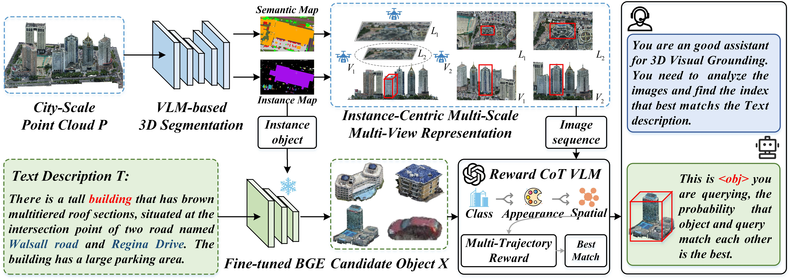

# CityVG: Contrastive Fine-Tuning and Reward-Based Chain-of-Thought Reasoning for Zero-Shot City-Scale 3D Visual Grounding
This is the official PyTorch implementation of (ACL2026)CityVG.

## Abstract

3D Visual Grounding (3DVG) locates objects in 3D scenes based on natural language descriptions. However, existing methods are primarily confined to small-scale indoor data or rely on heavy supervision, failing to generalize to the complexity of large-scale urban environments. To address this limitation, we present CityVG, the first city-scale zero-shot 3D visual grounding framework capable of localizing urban objects without manual annotations. Our approach adopts a retrieval-and-reasoning paradigm comprising two key components. Specifically, we propose a contrastive fine-tuning strategy to align textual queries with urban scene graphs. By leveraging an LLM-driven graph clustering mechanism, we automatically construct high-quality positive and negative training pairs and fine-tune the text encoder via contrastive learning, resulting in a scene-adaptive text encoder that enables efficient alignment without grounding supervision. Complementing this, we introduce a multi-trajectory reward-based Chain-of-Thought (CoT) reasoning strategy for inference. This mechanism iteratively evaluates candidate objects by aggregating reward scores across diverse reasoning trajectories, selecting the target that is most consistent with both appearance and spatial constraints. Extensive experiments on city-scale 3D grounding benchmarks demonstrate that CityVG achieves strong zero-shot localization performance and generalizes effectively to unseen urban environments.

<p align="center">
  
</p>

The script `run_scene.sh` provides the end-to-end execution path for a single `SCENE_ID`, including scene preprocessing, scene graph construction, candidate retrieval, and final visual grounding inference.

## Dataset Download and Preparation

This project uses the data related to the **CityRefer urban grounding task**. In practice, the required files come from three sources:

1. **CityRefer annotations**
2. **SensatUrban point clouds**
3. **Preprocessed auxiliary files** required by this repository

### 1. CityRefer annotations

Please download the [CityRefer dataset](https://github.com/ATR-DBI/CityRefer).

For this project, the important files are:

- scene/query annotations, used by `preprocess/saveBlockJson.py`
- 3D bounding box annotations, used by `sceneGraph/genGraph.py`

Organize them as:

```bash
CityVG
`-- data
    |-- cityrefer_inference
    |   `-- CityRefer_val_ND.json
    `-- cityrefer_bbox
        `-- box3d
            |-- birmingham_block_4_bbox.json
            |-- birmingham_block_5_bbox.json
            `-- ...
```

Notes:

- `CityRefer_val_ND.json` is the file directly read by `preprocess/saveBlockJson.py`.
- `<SCENE_ID>_bbox.json` is the file directly read by `sceneGraph/genGraph.py`.

### 2. SensatUrban point clouds

Please download the [SensatUrban dataset](https://github.com/QingyongHu/SensatUrban) and the corresponding segmentation support file:

- [SensatUrban segs data](https://drive.google.com/file/d/13BjNoqKrMJNOlNZiak_oV7b-TSMtst70)

For this project, the key raw files are the scene-level point clouds:

```bash
CityVG
`-- data
    `-- sensaturban
        |-- birmingham_block_4.ply
        |-- birmingham_block_5.ply
        `-- ...
```

These `.ply` files are directly used by:

- `preprocess/drawSemMap.py`
- `preprocess/genInsCenter.py`

If you want to regenerate the pointgroup-style intermediate files by yourself, you will also need to prepare the SensatUrban data and run:

```bash
cd preprocess
bash prepare_data.sh
```

### 3. Preprocessed auxiliary files required by this repository

Besides raw annotations and point clouds, this project also depends on scene-level preprocessed files. The most important one is:

- `data/data_cityrefer/sensaturban/pointgroup_data/balance_split/random-50_crop-250/<SCENE_ID>.pth`

This file is used by:

- `preprocess/genInsCenter.py`

Download the prepared files directly:

Download the prepared data from the following resources:

- [Prepared data package](https://drive.google.com/drive/folders/1_cOZFti4FyZtfAyEotXu1PEOFQZEcwBs?usp=drive_link)
- [Training / evaluation metadata](https://drive.google.com/drive/folders/1J4oRYT3tpdXQAt9mY3J3iu5GCDB03zPj?usp=drive_link)
- [3D object attribute features](https://drive.google.com/drive/folders/1BxyUBtBwvaiDNaUs9f236MaNVae17IXs?usp=drive_link)

For `run_scene.sh`, the most relevant prepared outputs are the scene-level `.pth` files and related auxiliary metadata.

Recommended organization:

```bash
CityVG
`-- data
    `-- data_cityrefer
        `-- sensaturban
            |-- meta_data
            `-- pointgroup_data
                `-- balance_split
                    `-- random-50_crop-250
                        |-- birmingham_block_4.pth
                        |-- birmingham_block_4.json
                        |-- birmingham_block_4.tif
                        |-- birmingham_block_4_landmark.json
                        `-- ...
```

## Minimum Data Needed for `run_scene.sh`

To run:

```bash
bash run_scene.sh <SCENE_ID>
```

you should at least prepare these files for the target scene:

```bash
data/cityrefer_inference/CityRefer_val_ND.json
data/cityrefer_bbox/box3d/<SCENE_ID>_bbox.json
data/sensaturban/<SCENE_ID>.ply
data/data_cityrefer/sensaturban/pointgroup_data/balance_split/random-50_crop-250/<SCENE_ID>.pth
```

Without these four inputs, the pipeline will fail in the early stages.

## Requirements

The repository is currently organized for a Linux-style runtime:

- Bash shell
- Conda environment
- Python environment created from `requirements.yml`
- Access to the required scene data and intermediate files under `data/`
- Valid VLM API credentials for the inference-related scripts

> Note: several scripts in this repository use hard-coded absolute paths such as `/home/zjj/Code/CityVG/...`. Before running the pipeline on a new machine, you should update those paths to match your local project directory.

## Installation

1. Create the Conda environment:

```bash
conda env create -f requirements.yml
conda activate CityVG
```

2. Check the hard-coded paths used in the pipeline scripts:

```bash
preprocess/saveBlockJson.py
preprocess/drawSemMap.py
preprocess/genInsCenter.py
preprocess/concatImage.py
sceneGraph/genCaption.py
sceneGraph/graphClustering.py
sceneGraph/contraGraph.py
sceneGraph/graphInference_Doubao.py
```

3. Make sure the VLM inference scripts are configured with your own API endpoint and key if needed.

## Quick Start

You can run the full pipeline for one scene with:

```bash
bash run_scene.sh <SCENE_ID>
```

For example:

```bash
bash run_scene.sh birmingham_block_4
```

If no scene id is provided, the script exits with:

```bash
Usage: bash run_scene.sh <SCENE_ID>
```

## Pipeline

`run_scene.sh` executes the following files in sequence:

```bash
python preprocess/saveBlockJson.py   --SCENE_ID "$SCENE_ID"
python preprocess/drawSemMap.py      --SCENE_ID "$SCENE_ID"
python preprocess/genInsCenter.py    --SCENE_ID "$SCENE_ID"
python preprocess/concatImage.py     --SCENE_ID "$SCENE_ID"

python sceneGraph/genGraph.py        --SCENE_ID "$SCENE_ID"
python sceneGraph/genCaption.py      --SCENE_ID "$SCENE_ID"
python sceneGraph/graphClustering.py --SCENE_ID "$SCENE_ID"
python sceneGraph/contraGraph.py     --SCENE_ID "$SCENE_ID"

python sceneGraph/graphInference_Doubao.py --SCENE_ID "$SCENE_ID"
```

### Stage 1: Scene Preprocessing

These scripts prepare the scene-specific assets used later by graph reasoning and visual grounding:

- `preprocess/saveBlockJson.py`
  Filters the scene annotations and saves scene-level query data to:
  `data/cityrefer_block/<SCENE_ID>.json`

- `preprocess/drawSemMap.py`
  Generates the semantic `.ply` file for the target scene.

- `preprocess/genInsCenter.py`
  Computes object instance centers and creates scene-level preprocessed assets.

- `preprocess/concatImage.py`
  Builds the candidate visualization panels used by downstream VLM inference.

### Stage 2: Scene Graph Construction

These scripts build graph-structured object context for the scene:

- `sceneGraph/genGraph.py`
  Generates the base graph file:
  `data/cityrefer_graph/<SCENE_ID>_graph.json`

- `sceneGraph/genCaption.py`
  Adds object- and graph-level captions:
  `data/cityrefer_graph/<SCENE_ID>_graph_captions.json`

- `sceneGraph/graphClustering.py`
  Performs clustering / representation learning and writes scene-specific checkpoints under:
  `checkpoints/<SCENE_ID>_Fine-tuned_BGE`

### Stage 3: Candidate Retrieval

- `sceneGraph/contraGraph.py`
  Produces the retrieved candidate set for each query:
  `data/cityrefer_candidate/<SCENE_ID>_candidates_qwen.json`

### Stage 4: Final Visual Grounding

- `sceneGraph/graphInference_Doubao.py`
  Uses the candidate panels and captions to perform final grounding with a vision-language model, and saves results to:
  `data/cityrefer_inference/<SCENE_ID>_inference.json`

## Outputs

After a successful run, you should typically obtain:

```bash
data/cityrefer_block/<SCENE_ID>.json
data/cityrefer_graph/<SCENE_ID>_graph.json
data/cityrefer_graph/<SCENE_ID>_graph_captions.json
checkpoints/<SCENE_ID>_Fine-tuned_BGE/
data/cityrefer_candidate/<SCENE_ID>_candidates_qwen.json
data/cityrefer_inference/<SCENE_ID>_inference.json
```

## Run Multiple Scenes

If you want to process several scenes sequentially, you can also use:

```bash
bash run_all_scenes.sh
```

This script repeatedly calls `run_scene.sh` for a predefined list of scene ids.

## Troubleshooting

- `bash: command not found`
  Use Linux / WSL / Git Bash instead of plain Windows PowerShell.

- `FileNotFoundError` with `/home/zjj/Code/CityVG/...`
  Replace the hard-coded absolute paths in the Python scripts with paths valid on your machine.

- API request failure in `graphInference_Doubao.py`
  Check the endpoint, model name, and API key configuration.

- Missing candidate images or graph files
  Re-run the previous stages and verify that each intermediate output has been generated before the final inference step.

## Acknowledgement

We gratefully acknowledge the authors of [CityRefer](https://github.com/ATR-DBI/CityRefer), [CityAnchor](https://github.com/WHU-USI3DV/CityAnchor), [Mask3D](https://github.com/JonasSchult/Mask3D), and [SensatUrban](https://github.com/QingyongHu/SensatUrban) for their valuable contributions and publicly available resources.

## Citation

If you find this project useful, please consider citing:

```bibtex
@inproceedings{zhang2026cityvg,
  title={CityVG: Contrastive Fine-Tuning and Reward-Based Chain-of-Thought Reasoning for Zero-Shot City-Scale 3D Visual Grounding},
  author={Zhang, Jianjun and Wang, Hanli},
  booktitle={Proceedings of the Annual Meeting of the Association for Computational Linguistics},
  year={2026}
}
```
